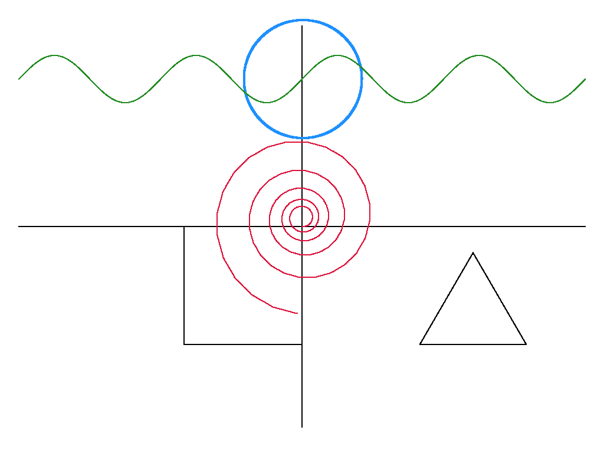

# GoTuga
A Turtle-Like Library For Go.  
I made it since I like Creative Coding, and gg By fogle man seems to be the only Library that really POPS in Ease of usage.  
And so EXISTS GoTuga!
## Documentation
You can Find the Documentation [Here](https://pkg.go.dev/github.com/Z6dev/GoTuga#section-readme)
## Setup
```bash
go get github.com/Z6dev/GoTuga
```


